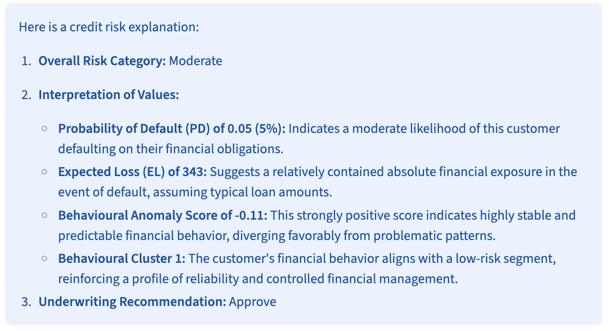
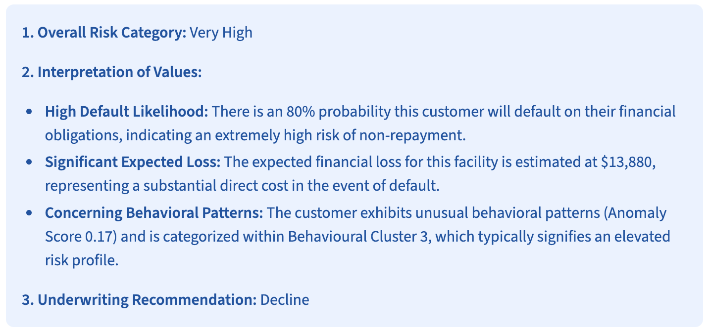

# 📘 **Customer Credit Risk & Behaviour Scoring**

A full end-to-end machine learning system for **credit risk assessment**, including:

* **PD (Probability of Default)**
* **LGD (Loss Given Default)**
* **Expected Loss = PD × LGD**
* **Customer Segmentation (KMeans)**
* **Behavioural Anomaly Detection (Isolation Forest)**
* **Time-Series Default Rate Forecasting (ARIMA)**
* **Autoencoder for deep behavioural embeddings**
* **FastAPI microservice for real-time model serving**
* **Streamlit dashboard with Gemini-powered explanations**

Built using Python, DuckDB, XGBoost, LightGBM, PyTorch, FastAPI, and Google Gemini.

---

## 🚀 Features

### 🧠 Machine Learning Models

* **PD Model:** XGBoost classifier using 10 financial features
* **LGD Model:** LightGBM regressor with realistic synthetic LGD targets
* **Expected Loss:** PD × LGD returned by the API
* **Segmentation:** KMeans clustering
* **Anomaly Detection:** Isolation Forest
* **Autoencoder:** 8-dim PyTorch latent embeddings
* **Time-Series:** ARIMA monthly default-rate forecasting

### 🔧 Engineering & Serving

* **FastAPI** microservice exposing `/predict`
* **Dockerfile** for containerized API deployment
* **Environment-safe model loading & caching**
* **Strict feature-ordering** via `feature_cols.json`

### 🤖 AI-Powered Credit Explanations

The Streamlit UI generates **human-readable credit summaries** using:

* **Google Gemini 2.5 Flash LLM**
* Secure `.env`-based API key loading
* Underwriter-style professional interpretations

### 📊 Dashboard (Streamlit)

* Clean, fintech-style UI
* Human-friendly input fields + tooltips
* Displays PD, Expected Loss, Cluster, Anomaly Score
* AI-generated credit explanation for end users

---

## 📂 Project Structure

```
project/
│
├── src/
│   ├── features_sql.py        # DuckDB feature engineering
│   ├── train_pd_model.py      # PD model training
│   ├── train_lgd_model.py     # LGD model training
│   ├── train_unsupervised.py  # KMeans + IsolationForest
│   ├── train_timeseries.py    # ARIMA forecasting
│   ├── train_autoencoder.py   # Deep autoencoder (PyTorch)
│   ├── config.py              # Paths and config
│   └── utils.py               # Shared utilities
│
├── service/
│   ├── app.py                 # FastAPI app
│   ├── model_loader.py        # Cached model loading & scalers
│   └── schemas.py             # API schemas
│
├── monitoring/
│   └── dashboard_streamlit.py # Streamlit dashboard UI
│
├── models/                    # Saved models & scalers (ignored in Git)
├── data/                      # Raw + processed data
├── .env                       # Gemini API key (ignored in Git)
└── Dockerfile                 # FastAPI deployment
```

---

## ▶️ Running the System

### **1. Add your Gemini API key to `.env`**

Create `.env`:

```
GEMINI_API_KEY=your_key_here
```

This file is **not committed** thanks to `.gitignore`.

---

### **2. Start FastAPI**

```bash
uvicorn service.app:app --reload --host 0.0.0.0 --port 8000
```

### **3. Start Streamlit**

```bash
streamlit run monitoring/dashboard_streamlit.py
```

---

### API Docs

[http://localhost:8000/docs](http://localhost:8000/docs)

### Streamlit Dashboard

[http://localhost:8501](http://localhost:8501)

---
## 📈 Example Predictions (Real Inputs + Screenshots)

Below are two real customer examples scored through the **Streamlit dashboard**.

---

### ✅ GOOD Customer Example

**Input values:**

| Feature                   | Value    |
| ------------------------- | -------- |
| Revolving Utilization (%) | **0.35** |
| Age                       | **42**   |
| 30–59 Days Late           | **1**    |
| 60–89 Days Late           | **0**    |
| 90+ Days Late             | **0**    |
| Debt Ratio                | **0.25** |
| Monthly Income            | **5500** |
| Credit Lines              | **6**    |
| Real Estate Loans         | **1**    |
| Dependents                | **2**    |

**Streamlit Output Screenshot:**



---

### ❌ BAD Customer Example

**Input values:**

| Feature                   | Value    |
| ------------------------- | -------- |
| Revolving Utilization (%) | **0.98** |
| Age                       | **22**   |
| 30–59 Days Late           | **3**    |
| 60–89 Days Late           | **2**    |
| 90+ Days Late             | **4**    |
| Debt Ratio                | **1.00** |
| Monthly Income            | **1500** |
| Credit Lines              | **12**   |
| Real Estate Loans         | **0**    |
| Dependents                | **3**    |

**Streamlit Output Screenshot:**



---

## 🔐 Security & Secrets

* `.env` used for Gemini API key
* `.gitignore` prevents PKL models and secrets from being committed
* No API keys appear in source code
* Fully compatible with Streamlit Cloud deployment

---

## 🛠 Technologies Used

* Python 3.11
* DuckDB
* XGBoost, LightGBM
* PyTorch
* FastAPI
* Streamlit
* Google Gemini
* scikit-learn
* statsmodels (ARIMA)
* Docker

---

## 📄 License

MIT License — free to use, modify, and build upon.